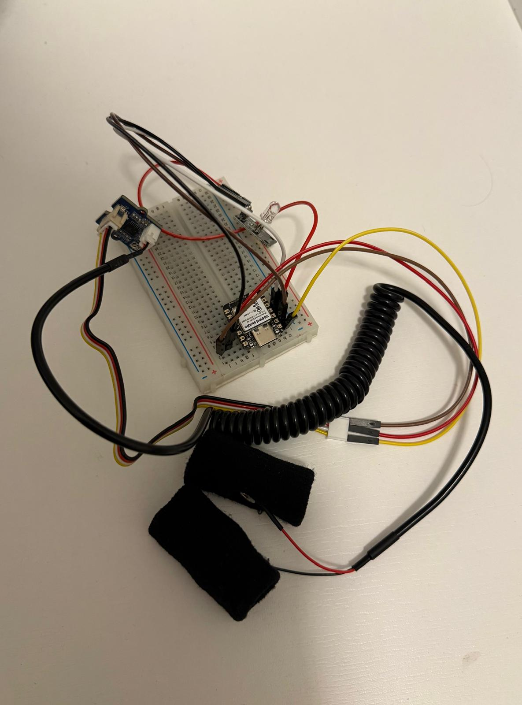

# XIAO ESP32-S3 ile GSR Yalan Makinesi

Bu proje, insanın stres ve heyecan anında cilt direncinde (GSR - Galvanic Skin Response) meydana gelen mikroskobik değişimleri analiz ederek çalışan biyometrik bir yalan makinesi prototipidir.

## 🛠️ Kullanılan Malzemeler

* **Mikrodenetleyici:** Seeed Studio XIAO ESP32-S3
* **Sensör:** Seeed Studio Grove GSR Sensör Modülü
* **Gösterge:** HW-479 RGB LED Modülü
* **Güç:** 3.7V 1000mAh LiPo Pil (veya Type-C USB)
* **Diğer:** Breadboard, Jumper Kablolar, Parmak Bantları

---

## 🔌 Devre Bağlantıları

### GSR Sensörü -> XIAO ESP32-S3
| GSR Sensör Pini | ESP32-S3 Pini | Açıklama |
| :--- | :--- | :--- |
| **SIG (Sarı)** | `A0` (D0) | Analog Veri Girişi |
| **NC (Beyaz)** | *Boş* | Bağlanmaz |
| **VCC (Kırmızı)**| `3V3` | 3.3V Güç Beslemesi |
| **GND (Siyah)** | `GND` | Toprak Hat |

### RGB LED Modülü -> XIAO ESP32-S3
| RGB LED Pini | ESP32-S3 Pini | Açıklama |
| :--- | :--- | :--- |
| **`-` (GND)** | `GND` | Ortak Eksi Hat |
| **`G` (Yeşil)** | `D1` | Sakin / Normal Durum |
| **`B` (Mavi)** | `D2` | Kalibrasyon / Tereddüt |
| **`R` (Kırmızı)**| `D3` | Yüksek Stres / Yalan |

---

## ⚙️ Çalışma Mantığı

1. **Kalibrasyon:** Cihaz açıldığında veya parmaklar takıldığında 5 saniye boyunca beyaz/mavi LED yanar ve kullanıcının anlık temel cilt direncini (`skinConductivity`) ölçer.
2. **Dinamik Tolerans (%10):** Sabit eşik değerleri yerine kişisel baz değere **%10 esneklik toleransı** eklenir.
3. **Analiz ve Yanıt:**
   * **Yeşil LED:** Cilt direnci normal sınırlar içindeyse (Sakin/Doğru).
   * **Mavi LED:** Cilt direnci %10 oranında artarsa (Hafif stres/Tereddüt).
   * **Kırmızı LED:** Cilt direnci %20 ve üzeri artış gösterirse (Yüksek Stres/Yalan).

---

## 📈 Seri Port Grafiği
Arduino IDE üzerindeki **Serial Plotter** ekranı açıldığında, eşik çizgileri ile anlık verinin kesişimi canlı olarak takip edilebilir:

